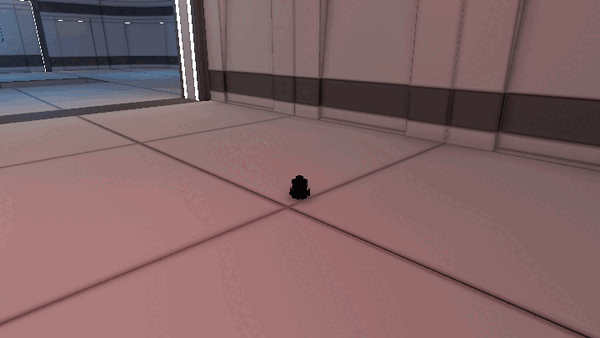
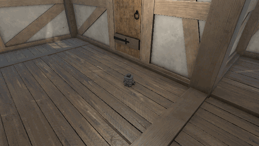
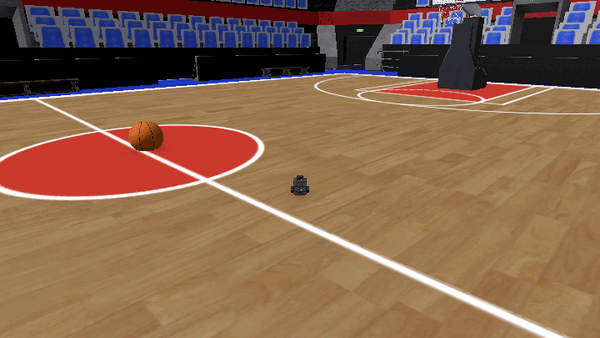
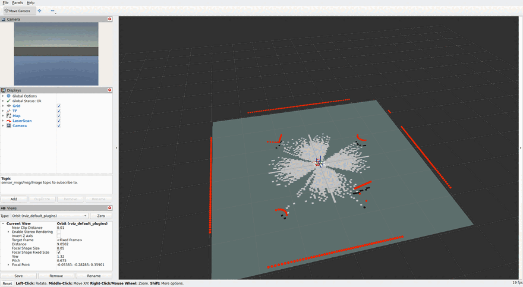
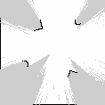
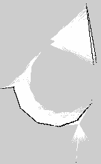
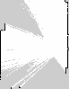
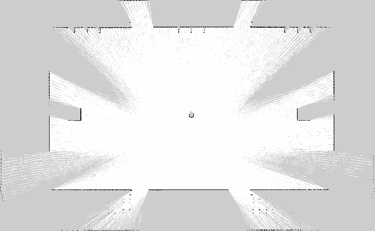
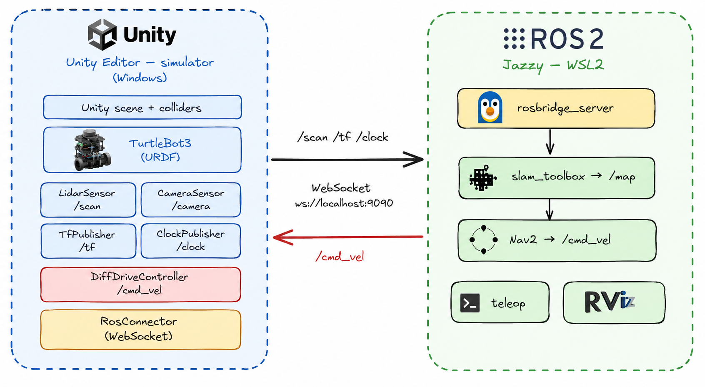

# TurtleBot3 SLAM + Nav2 in Unity with ros-sharp

Run the ROBOTIS TurtleBot3 navigation stack (`slam_toolbox` + `Nav2`) against a **Unity** simulation, using **ros-sharp** and **rosbridge** instead of Gazebo. Unity is only the simulator; all robotics logic (teleop, SLAM, navigation) runs on a standard ROS 2 backend. The robot can therefore be placed into any Unity scene and used as its world.

This reproduces the ROBOTIS [SLAM](https://emanual.robotis.com/docs/en/platform/turtlebot3/slam_simulation/) and [Navigation](https://emanual.robotis.com/docs/en/platform/turtlebot3/nav_simulation/) simulation tutorials, with Unity in place of Gazebo.

## Demonstrations

The same TurtleBot3 prefab, driven over `/cmd_vel` from the ROS 2 backend, in three downloaded Asset Store scenes:

| 3D Modular Kit | Medieval House | Basketball Arena |
|---|---|---|
|  |  |  |

## LiDAR and camera in RViz

The raycast LiDAR (`/scan`), the occupancy map `slam_toolbox` builds from it, the TF tree, and the onboard camera (top-left panel), all visualized in RViz while the robot drives:



## SLAM maps

| Sample room | Modular kit | Medieval house | Basketball arena |
|---|---|---|---|
|  |  |  |  |

*Maps built by `slam_toolbox` from the Unity LiDAR in four different scenes.*

---

## How it works

Unity publishes the same topics a real TurtleBot3 would, and subscribes to the same command topic. A ROS 2 backend runs the standard tools unmodified.



<details><summary>Same diagram as text</summary>

```
            Unity (simulator, this repo's scripts)
            ├─ /scan                  sensor_msgs/LaserScan      (raycast LiDAR)
            ├─ /camera/image_raw/...  sensor_msgs/CompressedImage
            ├─ /tf                    odom->base_footprint + link frames
            ├─ /clock                 rosgraph_msgs/Clock        (sim time)
            └─ /cmd_vel  (subscribed) geometry_msgs/Twist
                       |
                       |  WebSocket  ws://localhost:9090
                       v
            rosbridge_server  (rosbridge_suite)
                       |
                       |  DDS
                       v
            ROS 2 Jazzy backend
            ├─ slam_toolbox     /scan + /tf + /clock  ->  /map , map->odom
            └─ Nav2             /map + /scan          ->  /cmd_vel
```

</details>

Transport is ros-sharp's `RosConnector` talking to `rosbridge_server` over a WebSocket.

---

## Repo layout

This is a full Unity project you can clone and open, plus the ROS 2 backend and docs.

```
Assets/                       the Unity project, opened in Unity 6
  Scripts/                    the seven ros-sharp scripts
    LidarSensor.cs              raycast 2D LiDAR -> /scan
    CameraSensor.cs            URP camera -> /camera/image_raw/compressed
    DiffDriveController.cs     /cmd_vel -> kinematic base motion
    TfPublisher.cs             odom->base_footprint + link frames -> /tf
    ClockPublisher.cs          sim time -> /clock
    ClockMessage.cs            rosgraph_msgs/Clock (not shipped by ros-sharp)
    SimTime.cs                 one sim clock shared by every publisher
  Editor/Tbot3UrdfImport.cs    menu item to import the URDF from code
  Prefabs/TurtleBot3.prefab    ready-wired robot (RosConnector + sensors + drive)
  Tbot3/                       TurtleBot3 URDF + STL meshes (ROBOTIS, Apache-2.0)
  Scenes/Tbot3SampleEnv.unity  a room + the robot, ready to Play
  Settings/                    URP pipeline assets
Packages/manifest.json         declares ros-sharp (auto-pulled from GitHub) + URP
ProjectSettings/               Unity settings (URP, Run In Background, tags)
ros2/                          the ROS 2 backend (not a Unity folder)
  burger_unity.yaml            Nav2 params for normal indoor/open scenes
  burger_house.yaml            Nav2 params for tight, sparse-map scenes
  maps/                        example maps from the four scenes
docs/                          architecture.png + the GIFs
```

The three licensed Asset Store environments are **not** in this repository (see `.gitignore`); the sample room scene and the robot are original to this project and open without further setup.

---

## Clone and open

```bash
git clone https://github.com/prakash-aryan/turtlebot3-unity-rossharp.git
cd turtlebot3-unity-rossharp
```

Open the folder in Unity 6 (Unity Hub, **Add > Add project from disk**, then select the cloned folder). Unity resolves `ros-sharp` from `Packages/manifest.json` on first open, so no manual package installation is required. Open `Assets/Scenes/Tbot3SampleEnv.unity`, start the ROS 2 backend (Step 1), and press **Play**. To add the robot to an existing project instead of cloning this one, follow Step 2.

---

## Prerequisites

- **Unity 6** (6000.x) with the **Universal Render Pipeline**. The sensor scripts are written for URP; they also work in the built-in pipeline.
- **ros-sharp** (`com.siemens.ros-sharp`) added to your Unity project.
- **WSL2** with **Ubuntu 24.04** and **ROS 2 Jazzy** (or native Ubuntu 24.04).
- A 2D-capable scene with mesh colliders (the LiDAR raycasts against colliders).

---

## Step 1. ROS 2 backend (WSL or Ubuntu)

Install ROS 2 Jazzy from the [official guide](https://docs.ros.org/en/jazzy/Installation.html), then the packages this uses:

```bash
sudo apt update && sudo apt install -y \
  ros-jazzy-rosbridge-suite \
  ros-jazzy-slam-toolbox \
  ros-jazzy-navigation2 ros-jazzy-nav2-bringup \
  ros-jazzy-turtlebot3 ros-jazzy-turtlebot3-msgs ros-jazzy-turtlebot3-navigation2 \
  ros-jazzy-rmw-cyclonedds-cpp
```

Put this in every terminal (or in `~/.bashrc`):

```bash
source /opt/ros/jazzy/setup.bash
export RMW_IMPLEMENTATION=rmw_cyclonedds_cpp   # see note below
export TURTLEBOT3_MODEL=burger
```

**Use CycloneDDS.** On some Jazzy package snapshots the default FastDDS is ABI-mismatched and `rosbridge` crashes on startup with an `undefined symbol ...fastcdr...Cdr::serialize` error. Setting `RMW_IMPLEMENTATION=rmw_cyclonedds_cpp` avoids it. If FastDDS works for you, you can skip this, but CycloneDDS is the safe default here.

**WSL note.** WSL2 forwards `localhost`, so Unity on Windows reaches `rosbridge` in WSL at `ws://localhost:9090` with no extra networking. RViz works over WSLg.

Start the bridge (leave it running):

```bash
ros2 launch rosbridge_server rosbridge_websocket_launch.xml   # serves :9090
```

---

## Where the backend runs, and how Unity reaches it

Unity talks to the backend over **one WebSocket** to `rosbridge`. The only thing that changes between setups is the URL on the **RosConnector** (`RosBridgeServerUrl = ws://<HOST>:9090`). Choose the host that matches your setup.

### Option 1: WSL2 on the same Windows machine (simplest)
Run the backend in WSL2 Ubuntu. WSL2 forwards `localhost`, so Unity uses:

```
ws://localhost:9090
```

Nothing else to configure.

### Option 2: a separate Ubuntu machine (LAN box, dual-boot, or robot PC)
Run the backend on the Ubuntu machine and point Unity at that machine's IP.

1. On the Ubuntu machine, find its LAN IP:
   ```bash
   hostname -I            # e.g. 192.168.1.42
   # or:  ip addr show
   ```
2. Open the port if a firewall is on:
   ```bash
   sudo ufw allow 9090/tcp
   ```
3. Start rosbridge there. It binds to `0.0.0.0:9090` by default, so it already accepts LAN connections (be explicit if you like):
   ```bash
   ros2 launch rosbridge_server rosbridge_websocket_launch.xml address:=0.0.0.0 port:=9090
   ```
4. In Unity, set the RosConnector URL to that IP:
   ```
   ws://192.168.1.42:9090
   ```
5. Both machines must be on the same network and able to reach each other (`ping 192.168.1.42` from the Unity machine).

### Option 3: everything on one native Ubuntu machine
Unity (Linux Editor) and the backend on the same box:

```
ws://localhost:9090
```

### Changing the IP
`RosBridgeServerUrl` lives on the **RosConnector** component (robot root). Edit it in the Inspector, or set it from code before the connector starts:

```csharp
GetComponent<RosConnector>().RosBridgeServerUrl = "ws://192.168.1.42:9090";
```

### Notes
- Unity speaks **WebSocket to rosbridge**, not DDS, so the Unity side needs no `ROS_DOMAIN_ID` or DDS config. The ROS nodes behind rosbridge (slam_toolbox, Nav2) share the backend's DDS domain as usual.
- If it will not connect, check, in order: rosbridge is actually up (`ros2 node list` shows `/rosbridge_websocket`), the port is open (firewall), the IP is right, the two machines can `ping` each other, and the URL starts with `ws://` (not `http://`).
- A slow Wi-Fi link still degrades Nav2 even though scans are sim-time stamped; a wired connection is better for the control loop.

---

## Step 2. Unity setup

> **If you cloned this repository,** the project is already configured. Open it in Unity 6, allow ros-sharp to install from `Packages/manifest.json`, open `Assets/Scenes/Tbot3SampleEnv.unity`, and continue from Step 4. The steps below cover adding the robot to a separate Unity project.

1. **Add ros-sharp.** Window > Package Manager > **+** > *Add package from git URL*, and paste:
   ```
   https://github.com/siemens/ros-sharp.git?path=/com.siemens.ros-sharp
   ```

   (This repo already lists it in `Packages/manifest.json`, so a fresh clone pulls it automatically; you only do this for your own project.)

2. **Import the robot.** Copy this repo's `Assets/Tbot3/` into your project's `Assets/` folder, then use ros-sharp's **Assets > Import Robot from URDF file** and pick `turtlebot3_burger.urdf`. ros-sharp's `StlAssetPostProcessor` converts the STLs automatically. (`Editor/Tbot3UrdfImport.cs` does the same thing from a `Tools` menu item if you prefer a one-click/headless import.) The links come in as `base_footprint -> base_link -> {wheel_left_link, wheel_right_link, caster_back_link, imu_link, base_scan}`.

3. **Add the scripts.** Copy this repo's `Assets/Scripts/` into your project's `Assets/Scripts/`.

4. **Build the robot object.** On the imported robot root, add a ros-sharp `RosConnector`, then add `DiffDriveController`, `TfPublisher`, `ClockPublisher` to that same root. Add `LidarSensor` to the `base_scan` link. Add a `Camera` plus `CameraSensor` to a `camera_link` you create under `base_link` (the real Burger has no camera; this is optional but useful). Every sensor finds the one shared `RosConnector` on a parent, so they all use the same connection.

5. **Configure the RosConnector** (these three settings matter):

   | Setting | Value | Why |
   |---|---|---|
   | `RosBridgeServerUrl` | `ws://<host>:9090` | `<host>` = `localhost` for WSL, or the backend machine's IP (see *Where the backend runs* above) |
   | `Protocol` | **WebSocketNET** | the WebSocketSharp transport is unreliable in this setup |
   | `Serializer` | **Newtonsoft JSON** | see below |

**Serializer must be Newtonsoft.** ros-sharp's message classes are inconsistent: some use C# properties, some use plain public fields (`geometry_msgs/Quaternion` and `builtin_interfaces/Time` are fields). The default Microsoft `System.Text.Json` serializer only emits properties, so field-based messages silently go out as defaults: quaternions arrive as identity, timestamps as zero. Newtonsoft serializes both. This is mandatory for TF, poses, and anything timestamped.

6. **Player Settings > Run In Background = true.** When the Editor is unfocused (common when you drive it from a tool or alt-tab), the play-mode game loop stalls while background threads keep running. Subscribing still works but nothing gets published. Turning this on keeps `/scan`, `/tf`, and `/clock` flowing.

---

## Step 3. What each script does

All publishers stamp their messages with `SimTime.Now` (`Time.timeAsDouble`), not wall time, so `use_sim_time:=true` stays consistent across the whole stack. Do not use ros-sharp's `HeaderExtensions.Update()`; it stamps wall time.

- **LidarSensor.cs** (on `base_scan`) casts `Samples` rays in a full circle and publishes `sensor_msgs/LaserScan` on `/scan`. Defaults match the LDS-01: 360 samples, 0.12-3.5 m, 5 Hz. Unity yaw is clockwise, so the ray angle is negated to keep the ROS counter-clockwise convention. A no-return reads `0` (treated as "invalid", which is below `range_min`). `RangeMax` is public: raise it for large open scenes (see Step 6).
- **CameraSensor.cs** (on `camera_link`) reads the camera into a `RenderTexture` in `LateUpdate` and publishes `sensor_msgs/CompressedImage` (JPEG). It does the readback itself because ros-sharp's built-in `ImagePublisher` relies on `Camera.onPostRender`, which URP never fires.
- **DiffDriveController.cs** (on the root) subscribes to `/cmd_vel` (`geometry_msgs/Twist`) and integrates a kinematic base. `angular.z` is negated for Unity's left-handed yaw. Speeds are clamped to Burger limits (0.22 m/s, 2.84 rad/s).
- **TfPublisher.cs** (on the root) publishes `odom->base_footprint` from the world pose plus the static URDF link frames, converting with ros-sharp's `Unity2Ros`. It deliberately does **not** publish `map->odom`; SLAM owns that.
- **ClockPublisher.cs** + **ClockMessage.cs** publish `rosgraph_msgs/Clock`. ros-sharp does not ship that message type, so `ClockMessage.cs` defines it.
- **SimTime.cs** is the single source of sim time shared by all of the above.

---

## Step 4. Run SLAM

With `rosbridge` running and your Unity scene in **Play**:

```bash
# build a map from the Unity LiDAR
ros2 launch slam_toolbox online_async_launch.py use_sim_time:=true

# drive to explore (teleop), or publish /cmd_vel yourself
ros2 run turtlebot3_teleop teleop_keyboard

# optional: watch the scan, map, TF, and camera in RViz (WSLg works)
ros2 run rviz2 rviz2 -d ros2/sensors.rviz --ros-args -p use_sim_time:=true

# the camera panel needs the compressed image decoded to raw:
#   sudo apt install ros-jazzy-compressed-image-transport      # one time
ros2 run image_transport republish --ros-args -p in_transport:=compressed \
  -r in/compressed:=/camera/image_raw/compressed -r out:=/camera/image_raw

# save the map when the scene is covered
ros2 run nav2_map_server map_saver_cli -f my_map --ros-args -p use_sim_time:=true
```

`use_sim_time:=true` everywhere is required; it makes the stack follow Unity's `/clock`. Without `/clock` flowing, `slam_toolbox` drops every scan.

---

## Step 5. Run Nav2

Keep `rosbridge`, Unity (Play), and `slam_toolbox` running (SLAM provides `map->odom`), then:

```bash
ros2 launch nav2_bringup navigation_launch.py use_sim_time:=true \
  params_file:=ros2/burger_unity.yaml

# send a goal (must be inside the map, in the map frame; see troubleshooting)
ros2 action send_goal /navigate_to_pose nav2_msgs/action/NavigateToPose \
  "{pose: {header: {frame_id: map}, pose: {position: {x: 1.0, y: 0.0}, orientation: {w: 1.0}}}}"
```

Or click **Nav2 Goal** in RViz. `ros2/burger_unity.yaml` is a copy of the ROBOTIS Burger params with two fixes for this setup (see below). For cramped scenes or thin maps use `ros2/burger_house.yaml` instead.

---

## Step 6. Use your own Unity environment

The robot is scene-agnostic. To make any scene work:

1. **Colliders.** The LiDAR raycasts against physics colliders, so every visible surface needs one. Add a `MeshCollider` to each `MeshFilter` that lacks a collider.
2. **URP materials.** Imported or Asset Store models built for the built-in pipeline render magenta under URP. Reshade their materials to `Universal Render Pipeline/Lit` (keep the main texture and color).
3. **Put the robot on the floor.** Place it so the wheels rest on the ground, not floating. A reliable way: take the robot's combined renderer-bounds minimum Y (the wheel bottoms), raycast straight down to the floor, and move the root so the wheels sit on it.
4. **LiDAR range vs scene size.** The 3.5 m LDS-01 sees nothing across a large open space. Raise `LidarSensor.RangeMax` (for example 18 m for an arena); `slam_toolbox` clamps to its own `max_laser_range`. Indoors, keep 3.5 m.
5. **Nav2 params.** Use `burger_unity.yaml` for normal rooms. For tight or sparsely-mapped scenes use `burger_house.yaml`, which lowers `inflation_radius`, sets `track_unknown_space: false` (so the planner routes through unmapped cells), and relaxes the progress checker.

---

## Troubleshooting

- **Nothing publishes from Unity (subscribing works).** Turn on Player Settings > Run In Background. The unfocused Editor stalls the game loop.
- **TF rotations are always identity / `/clock` stamps are zero.** RosConnector Serializer is on Microsoft JSON. Switch it to Newtonsoft.
- **rosbridge crashes with a `fastcdr` symbol error.** Use CycloneDDS (`export RMW_IMPLEMENTATION=rmw_cyclonedds_cpp`).
- **The robot does not move under Nav2.** Jazzy Nav2 publishes `geometry_msgs/TwistStamped` on `/cmd_vel` by default, but the controller here subscribes to plain `Twist`. The provided params set `enable_stamped_cmd_vel: false` on the controller, behavior, smoother, collision monitor, and docking servers. Also `collision_monitor`'s scan `source_timeout` is raised to 2.0 s so it accepts the 5 Hz LiDAR.
- **Nav2 goal aborts with "Goal Coordinates ... outside bounds".** The robot's pose in the SLAM map is not (0,0); `slam_toolbox` chooses the map origin. Read the live pose from the `bt_navigator` log line `Begin navigating from current location (X, Y)` or with `ros2 run tf2_ros tf2_echo map base_footprint`, and aim a goal near there, inside the map.
- **Nav2 aborts with a TF / "Transform data too old" error in a heavy scene.** A GPU-heavy scene drives `/clock` slowly, so transforms lag the scan. Raise `transform_tolerance` to ~1.0 (already done in `burger_house.yaml`).
- **Magenta robot or world.** Built-in-pipeline materials under URP. Reshade to `Universal Render Pipeline/Lit`.

---

## Credits and license

- The TurtleBot3 model (`Assets/Tbot3/`) is from [ROBOTIS](https://github.com/ROBOTIS-GIT/turtlebot3) and is licensed Apache-2.0.
- [ros-sharp](https://github.com/siemens/ros-sharp) by Siemens (Apache-2.0) provides the Unity <-> rosbridge transport and the URDF importer.
- The code in this repo (`Assets/Scripts`, `Assets/Editor`, `ros2/`) is released under the MIT License (see `LICENSE`).

The downloaded Unity environments used in the example maps are third-party Asset Store content and are not included here. Use your own scene as described in Step 6.
